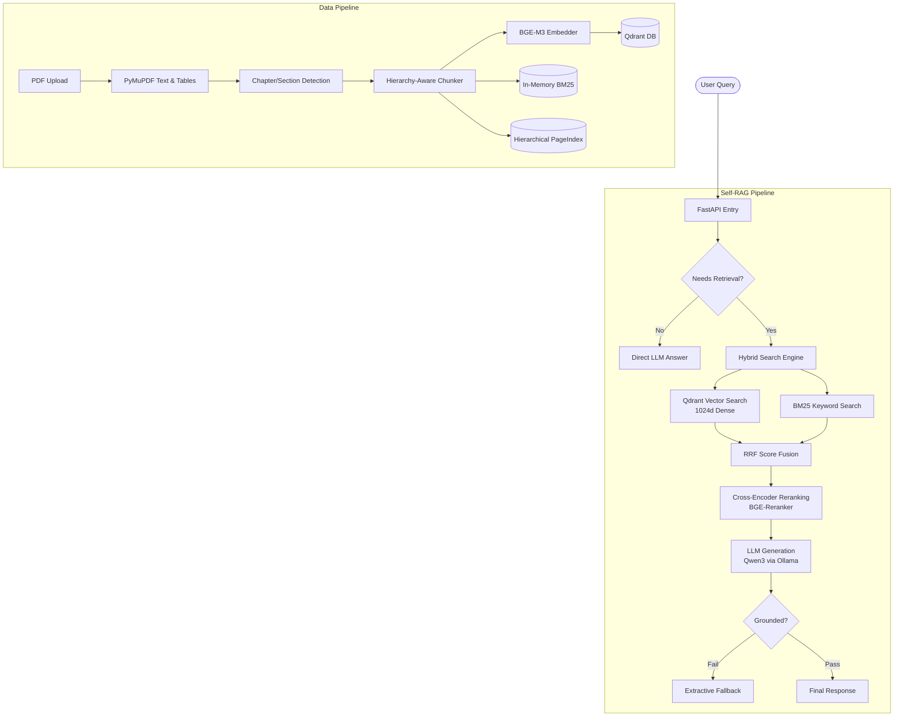

# Architecture

## Component Interaction



## Data Schema

### Chunk Payload (Qdrant)
```json
{
  "chunk_id": "uuid",
  "manual_id": "uuid",
  "manual_name": "Robot Arm Setup",
  "filename": "robot_arm_v2.pdf",
  "chapter": "3. Maintenance",
  "section": "3.1 Lubrication",
  "page": 42,
  "chunk_index": 125,
  "text": "Apply 10ml of grease...",
  "content_type": "text",
  "hierarchy_path": "Robot Arm Setup > 3. Maintenance > 3.1 Lubrication",
  "has_tables": false
}
```
