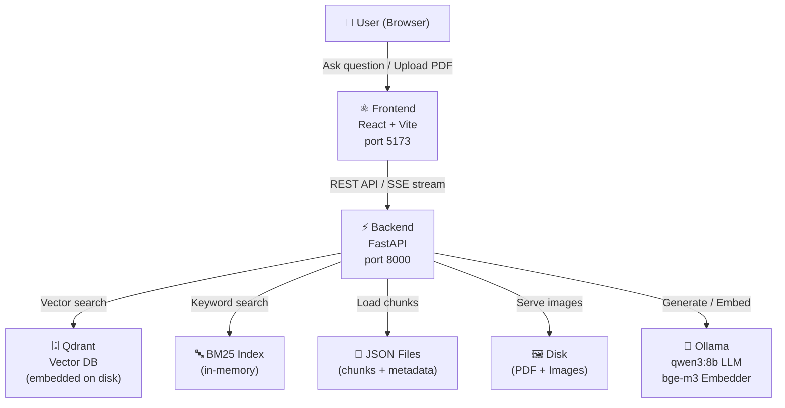
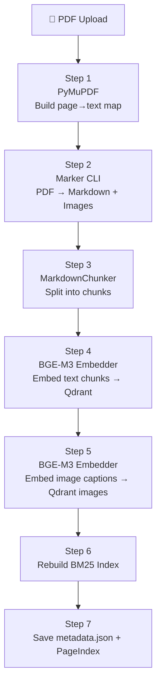
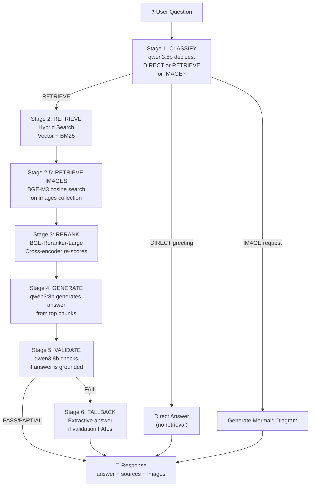

# 🤖 Industrial Manual Chatbot — Full Project Walkthrough

## What Is This Project?

This is a **full-stack offline AI chatbot** for industrial machine manuals. Users upload PDF manuals, the system processes and indexes them, and users can then ask natural language questions and get answers grounded in those manuals — including images and Mermaid diagrams.

It runs **entirely locally/offline**: no cloud APIs, no external databases.

---

## 🏗️ High-Level Architecture



---

## 📁 Project Structure

```
main isra chatbot 2/
├── backend/
│   ├── main.py               ← FastAPI app entry point
│   ├── .env                  ← All config (model, ports, thresholds)
│   └── app/
│       ├── api/              ← HTTP endpoints (chat, stream, manuals, images…)
│       ├── core/             ← Settings, logging
│       ├── database/         ← Qdrant store
│       ├── embeddings/       ← BGE-M3 embedder
│       ├── ingestion/        ← PDF → Markdown + chunking
│       ├── indexing/         ← PageIndex (hierarchy)
│       ├── llm/              ← Qwen3 via Ollama
│       ├── rag/              ← Self-RAG pipeline (6 stages)
│       ├── reranker/         ← Cross-encoder reranker
│       ├── retrieval/        ← Hybrid search (Vector + BM25)
│       ├── schemas/          ← Pydantic response models
│       └── services/         ← PDF service (ingest + delete)
└── frontend/
    └── src/
        ├── App.jsx           ← Main app, chat state, API calls
        └── components/
            ├── ChatInput.jsx
            ├── Header.jsx
            ├── Message.jsx   ← Renders markdown, Mermaid, images
            ├── Sidebar.jsx   ← Manual list + upload
            └── KnowledgeInfo.jsx
```

---

## 📥 PART 1: How Data Is STORED (Ingestion Pipeline)

When you upload a PDF, `ingest_pdf()` in [pdf_service.py](file:///Users/shivaai/Desktop/main%20isra%20chatbot%202/backend/app/services/pdf_service.py) runs a **7-step pipeline**:

### Step-by-Step Ingestion



### Step 1 — Page-Text Map (PyMuPDF)
- Opens the PDF with **PyMuPDF (fitz)**
- Extracts the raw text of every page → `{page_num: text}`
- Used later to caption images with actual page text (no LLM needed)

### Step 2 — Marker Extraction
- Runs the `marker_single` CLI tool
- Converts the PDF → **clean Markdown** (preserving headings `#`, `##`, `###`)
- Also extracts embedded **images/diagrams** to disk as `.png`/`.jpg`
- If Marker finds no images → **PyMuPDF fallback**: renders each page as an image at 150 DPI

### Step 3 — Chunking ([chunker.py](file:///Users/shivaai/Desktop/main%20isra%20chatbot%202/backend/app/ingestion/chunker.py))
- Uses **LangChain `MarkdownHeaderTextSplitter`** to split by headers (`#`, `##`, `###`, `####`)
- Then further splits with **`RecursiveCharacterTextSplitter`** (chunk_size=900, overlap=120)
- Each chunk gets rich metadata:

| Field | Example |
|-------|---------|
| `chunk_id` | `abc12345_0` |
| `manual_id` | `abc12345` |
| `chapter` | `Chapter 3 - Installation` |
| `section` | `Electrical Connections` |
| `hierarchy_path` | `Manual Name > Chapter 3 > Electrical Connections` |
| `content_type` | `text`, `table`, `safety`, `error_code`, `list` |
| `has_images` | `true` / `false` |
| `images_referenced` | `["page_5.png"]` |

- Chunks saved to disk as **`{manual_id}_chunks.json`** (backup/inspection)

### Step 4 — Text Embedding → Qdrant
- **BGE-M3** (BAAI/bge-m3, 1024-dim) embeds all chunk texts
- Vectors + metadata upserted to **Qdrant collection** `industrial_manuals`
- Similarity metric: **cosine distance**

### Step 5 — Image Captioning + Embedding → Qdrant
- For each extracted image: look up the page text from the map (Step 1)
- Caption = `"Page N: <actual page text up to 600 chars>"`
- **BGE-M3** embeds the caption text (not the image pixels!)
- Vectors + image metadata upserted to **Qdrant collection** `industrial_manuals_images`

### Step 6 — Rebuild BM25 Index
- Fetches all payloads from Qdrant
- Builds an **in-memory `BM25Okapi`** (rank_bm25) index from all chunk texts
- Used for keyword/sparse search

### Step 7 — Metadata + PageIndex
- Writes manual info to **`metadata.json`** (id, filename, chunk count, size, timestamps)
- Loads chunks into **in-memory `PageIndex`** (hierarchical tree for navigation)

---

## 🗄️ Storage Locations Summary

| What | Where | Format |
|------|-------|--------|
| Original PDFs | `data/manuals/{manual_id}_{filename}.pdf` | Binary |
| Extracted images | `data/manuals/{manual_id}_images/page_N.png` | PNG/JPG |
| Text chunks | `data/manuals/{manual_id}_chunks.json` | JSON |
| Manual metadata | `data/manuals/metadata.json` | JSON |
| Text vectors | `data/qdrant_storage/` (embedded Qdrant) | Binary (Qdrant) |
| Image vectors | `data/qdrant_storage/` (images collection) | Binary (Qdrant) |
| BM25 index | RAM only (rebuilt on startup) | In-memory |
| PageIndex tree | RAM only (rebuilt on startup) | In-memory |

---

## 🔍 PART 2: How Data Is RETRIEVED (Query Pipeline)

When a user sends a message, the **Self-RAG pipeline** in [self_rag.py](file:///Users/shivaai/Desktop/main%20isra%20chatbot%202/backend/app/rag/self_rag.py) runs **6 stages**:



---

### Stage 1 — Classify
- `qwen3:8b` reads the query and replies with exactly one word: **`DIRECT`** or **`RETRIEVE`**
- Also checks: is this an **image/diagram request**? → `IMAGE` or `TEXT`
- Default is always `RETRIEVE` (safer)

---

### Stage 2 — Hybrid Search ([hybrid_search.py](file:///Users/shivaai/Desktop/main%20isra%20chatbot%202/backend/app/retrieval/hybrid_search.py))

Two searches run in parallel and are **fused**:

#### 2a. Vector Search (Semantic)
```
User query → BGE-M3 embed → 1024-dim vector
            ↕ cosine similarity
Qdrant collection → top 30 chunks
```

#### 2b. BM25 Search (Keyword)
```
User query → tokenize (lowercase, strip punctuation)
           → BM25Okapi.get_scores()
           → top 30 chunks by TF-IDF score
```

#### 2c. Fusion — Reciprocal Rank Fusion (RRF)
```
RRF score = 1/(60 + rank_vector) + 1/(60 + rank_bm25)
```
- Chunks that appear high in **both** lists get the highest fused score
- Results sorted by fused score → top K returned

---

### Stage 2.5 — Image Retrieval
- Same BGE-M3 embedding of the query
- **Cosine search** on the `_images` Qdrant collection
- Filtered by `relevance_threshold = 0.2`
- Returns up to 4 most relevant images

---

### Stage 3 — Rerank ([cross_encoder](file:///Users/shivaai/Desktop/main%20isra%20chatbot%202/backend/app/reranker/cross_encoder.py))
- **BAAI/bge-reranker-large** cross-encoder
- Scores each `(query, chunk_text)` pair directly
- Re-sorts the top 30 → keeps only top 5 (most precise)
- Cross-encoder is **much more accurate** than vector similarity alone

---

### Stage 4 — Generate
- Builds a prompt: `SYSTEM_PROMPT + Context (top 5 chunks) + Question`
- Calls `qwen3:8b` via **Ollama HTTP API**
- The LLM is instructed to:
  - Answer **only** from the provided context
  - Use Markdown formatting
  - Include a **Mermaid diagram** for every technical answer
- Supports both **streaming** (SSE) and **non-streaming** modes

---

### Stage 5 — Validate
- `qwen3:8b` receives: question + context + generated answer
- Replies with exactly: **`PASS`**, **`PARTIAL`**, or **`FAIL`**
- If `FAIL` → triggers Stage 6 fallback

---

### Stage 6 — Fallback
- Extractive fallback: directly quotes top 3 chunks from the manual
- No LLM generation — pure text extraction

---

## ⚛️ PART 3: Frontend

**React + Vite + TailwindCSS** app:

| Component | Role |
|-----------|------|
| [Sidebar.jsx](file:///Users/shivaai/Desktop/main%20isra%20chatbot%202/frontend/src/components/Sidebar.jsx) | Lists indexed manuals, handles PDF upload |
| [ChatInput.jsx](file:///Users/shivaai/Desktop/main%20isra%20chatbot%202/frontend/src/components/ChatInput.jsx) | Message input, send button |
| [Message.jsx](file:///Users/shivaai/Desktop/main%20isra%20chatbot%202/frontend/src/components/Message.jsx) | Renders markdown, **Mermaid diagrams**, source cards, images |
| [KnowledgeInfo.jsx](file:///Users/shivaai/Desktop/main%20isra%20chatbot%202/frontend/src/components/KnowledgeInfo.jsx) | Shows system info (model, vectors, pipeline) |
| [App.jsx](file:///Users/shivaai/Desktop/main%20isra%20chatbot%202/frontend/src/App.jsx) | Main state: messages, selected manuals, SSE streaming |

**SSE Streaming Flow:**
```
Frontend → POST /api/v1/stream → Backend
Backend → yields SSE events:
  • stage: { classify, retrieve, rerank, generate, validate }
  • token: { text: "..." }   ← streams word by word
  • images: [ { image_url, page, ... } ]
  • done: { sources, answer_mode, processing_time_ms }
Frontend → updates UI in real-time
```

---

## 🔧 Key Configuration (`.env`)

| Setting | Value | Meaning |
|---------|-------|---------|
| `OLLAMA_MODEL` | `qwen3:8b` | Main LLM for answers |
| `OLLAMA_VLM_MODEL` | `qwen3-vl:8b` | Vision LLM (for captioning, optional) |
| `EMBEDDING_MODEL` | `BAAI/bge-m3` | 1024-dim embedder |
| `RERANKER_MODEL` | `BAAI/bge-reranker-large` | Cross-encoder reranker |
| `CHUNK_SIZE` | `900` | Max chars per chunk |
| `CHUNK_OVERLAP` | `120` | Overlap between chunks |
| `RETRIEVAL_TOP_K` | `30` | Chunks fetched before reranking |
| `RERANKER_TOP_K` | `5` | Chunks after reranking |
| `RELEVANCE_THRESHOLD` | `0.2` | Min cosine score for images |
| `HYBRID_SEARCH_ALPHA` | `0.6` | Weight: 60% vector, 40% BM25 |
| `QDRANT_USE_EMBEDDED` | `true` | No Docker needed — runs in-process |

---

## 🚀 Startup Sequence

When `main.py` starts:
1. **Connect to Qdrant** (embedded, on disk at `./data/qdrant_storage`)
2. **Rebuild BM25 index** from Qdrant payloads
3. **Load PageIndex** from saved chunk JSONs
4. **Background threads** load BGE-M3, reranker, and HF fallback (if enabled)
5. **Serve frontend** from `frontend/dist/` (built React app)
6. Optionally opens a **native desktop window** via `pywebview`
